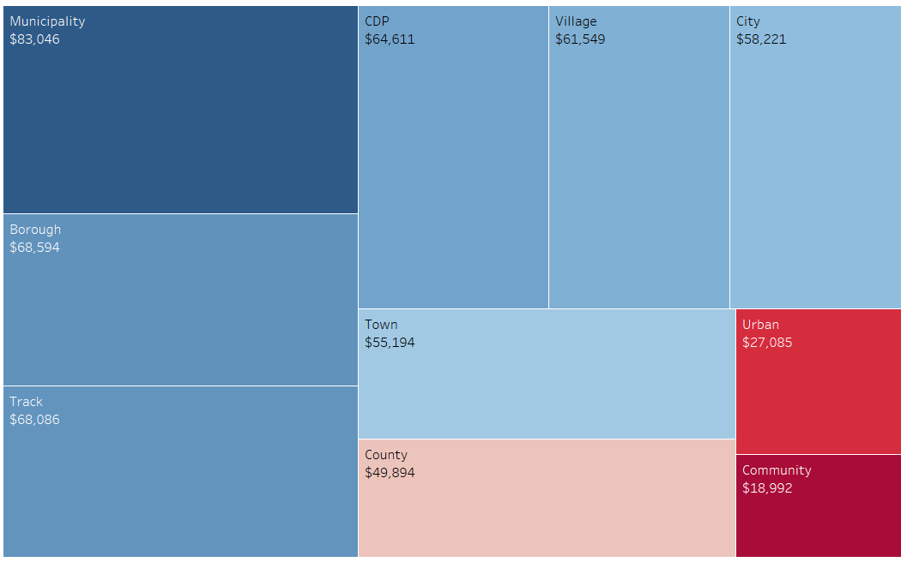
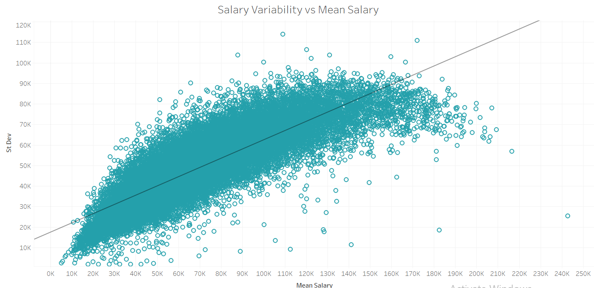
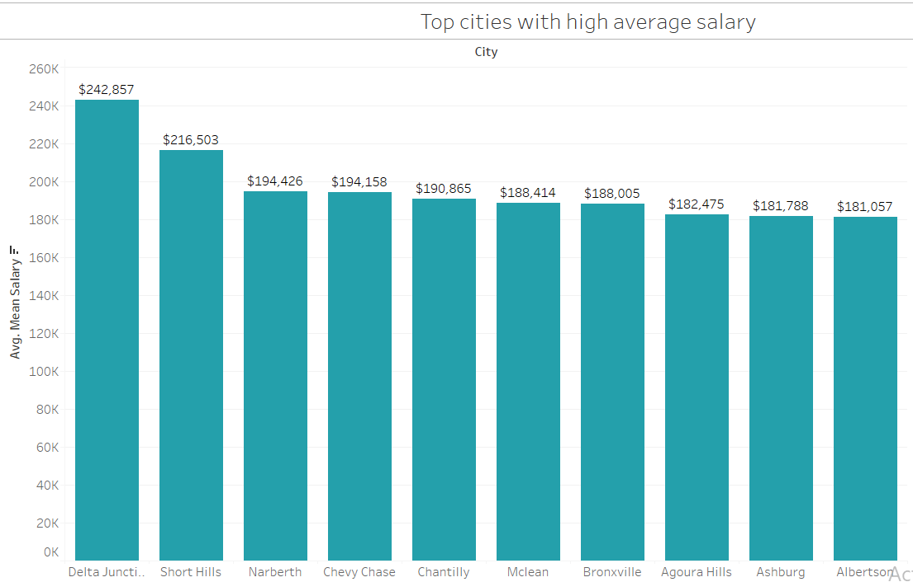

# Automated Data Cleaning and EDA of US Household Income Data
This repository contains the code and datasets for automating data cleaning and performing exploratory data analysis (EDA) on US household income data.

## Datasets
- USHouseholdIncome.csv: Contains US household and geographic information.
- USHouseholdIncome_Statistics.csv: Includes statistical data like mean, median, standard deviation, and sum of wages (salary).
- us_cities_reference.csv: Geographic location reference, used for cleaning purposes.
- us_household_summary_statistics.csv: The final output file, created after joining cleaned household data with statistics for EDA.
## Process Overview
### 1. Data Extraction and Loading
Source: The data was extracted from Kaggle.
The raw data is loaded into a table us_household_income_raw.
### 2. Manual Data Insertion
A stored procedure inserts the raw data into an intermediate staging table named as us_household_income_intermediate.
### 3. Automated Data Cleaning
A trigger (in automatic_data_cleaning.sql) performs the automated data cleaning when data is inserted. Key cleaning steps include:
- Removing duplicate records.
- Proper casing for all values (e.g., city names).
- Correcting misspelled data.
- Standardizing and removing data inconsistencies.
### 4. Final Data Load
After cleaning, another trigger loads the final data into the us_household_income_cleaned table which is optimized for analysis.
### 5. View Creation for EDA
A view is created by joining the clean household data with statistics data, ready for exploratory data analysis (EDA).

## EDA
### 1: Distribution Plot of Household Income
In the first step of my analysis, I explored the overall distribution of household income across the US. I created a distribution plot using binning techniques to capture the spread of income values. Upon analysis, I found that the data is right-skewed. This suggests that while a large proportion of households earn within a lower-to-middle income range, there is a smaller yet significant number of households earning much higher incomes, creating a long tail in the distribution.

### 2: Average Mean Salary by State
In the next step of my analysis, I visualized the average household salary across different states using a treemap. This allowed me to quickly see how salaries vary geographically. States with higher average salaries occupy larger sections of the treemap, making it easier to identify salary concentration across regions.

- States like the District of Columbia and Connecticut  are prominently featured due to their high average household incomes.
- On the other end, states like Puerto Rico and Mississippi have smaller blocks, representing lower average salaries.

### 3: Average Mean Salary by Type 
In this step, I analyzed household incomes based on different types of regions, such as city, borough, county, village, and municipality. I created a treemap to visualize the contribution of each type to overall salary levels. The size of each block represents the average salary in that type of region.
- Municipalities tend to lead with the highest average salaries.
- Communities or smaller regions show weaker salary levels, as seen by their smaller representation in the treemap.

### Relationship between Mean Salary and Variability
In this step, I examined the relationship between salary variability and average salary using a scatter plot. This visualization helps to understand how the spread (or variability) in salaries correlates with the overall average salary across different regions.

- There is a positive relationship between salary variability and average salary, with an overall R-squared value of 0.7093, suggesting a strong correlation.
- Regions with higher average salaries tend to show greater variability, meaning there is a wider spread in income levels.

I created a scatter plot specifically for salaries greater than $140K to explore high-income households in more detail. This plot aims to examine whether salary variability still shows a strong correlation with the average salary in the upper-income bracket.

- The relationship between salary variability and average salary in this segment is much weaker, with an R-squared value of only 0.025.
- This indicates that for households earning over $140K, the spread of salaries does not significantly vary with the average income in the region.

  

### Top 10 and Bottom 10 Cities by Mean Household Salary
Top 10 cities by average mean Salary

Bottom 10 Cities by average mean Salary

